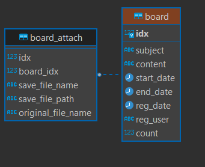

# 공지사항 api

### API 가이드 링크

https://documenter.getpostman.com/view/29702080/2s9YC4UDBw#33918c26-f314-4f0e-a24d-acba2f48cb18

 
 

### 공지 사항, 첨부 파일 ERD

 

### 개발 환경은 Spring boot, Jpa, Junit5로 구성

 
 

### 문제 해결 전략

- Jpa의 양방향 매핑을 사용하여, 추후 확장성 고려(JPQL 사용 시 역방향 탐색)
- Junit5를 이용한 단위테스트(Service 테스트), 통합테스트(Controller 테스트) 구현 및 테스트 완료
- API 가이드는 Junit5를 이용하여 Spring Rest Docs를 활용하려 했으나, 레퍼런스 및 신규 버전에 대한 커뮤니티가 없어 Postman Document로 대체